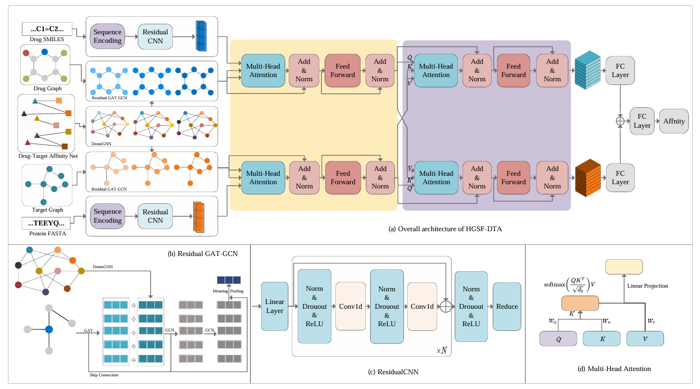

# HGSF-DTA

## Overview of Source Codes
- `materials/`:  raw materials of the Davis dataset and the KIBA dataset.
- `data/`: the input data of our model.
- `metrics.py`:  the evaluation metrics used in our experiments (i.e., MSE, CI, $r_m^2$, Pearson, and AUPR).
- `GraphInput.py`: contains the construction processes of the affinity graph, the drug molecule graph and the target molecule graph.
- `model.py`:  HGSF-DTA model.
- `train1.py`: 
- `train2.py`: Cold drug scene.
- `train3.py`: Cold protein scene.
- `train4.py`: Cold pair scene.
- `myutils.py`: contains utility functions.