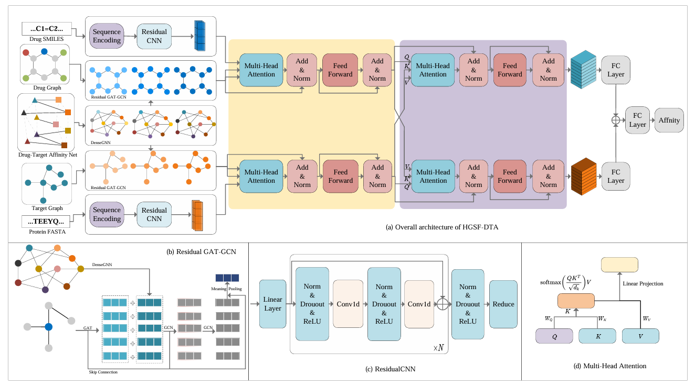

# HGSF-DTA: Multi-modal Deep Learning for Drug-Target Affinity Prediction



## Overview

This repository provides the implementation of HGSF-DTA (Hierarchical Graph Structure Fusion for Drug-Target Affinity prediction), a novel deep learning model that integrates sequence information, molecular graphs, and affinity networks to predict drug-target binding affinity (DTA). The model, detailed in our paper [Multi-modal Data Fusion-Enhanced Deep Learning Model for Predicting Drug-Target Binding Affinity](insert_link_here), outperforms existing methods on the Davis and KIBA datasets and addresses cold-start scenarios.
## Requirements

### Environment

- Python 3.8 or higher (tested on Python 3.11.5)
- CUDA-enabled GPU (recommended for faster training)

### Dependencies

Create a conda environment and install the required packages:

```bash
conda create -n hgsf-dta python=3.8
conda activate hgsf-dta
```

Install the following packages:

```bash
# Core deep learning frameworks
pip install torch==2.0.1+cu118 -f https://download.pytorch.org/whl/torch_stable.html
pip install torch-geometric==2.3.0
pip install torch-scatter torch-sparse -f https://data.pyg.org/whl/torch-2.0.1+cu118.html

# Scientific computing
pip install numpy==1.24.3
pip install pandas==2.0.3
pip install scikit-learn==1.3.0

# Chemistry and molecular processing
pip install rdkit-pypi==2022.9.5
pip install networkx==3.1

# Bioinformatics and survival analysis
pip install lifelines==0.27.7

# Tensor operations
pip install einops==0.6.1

# Additional utilities
pip install argparse
```

Or install from a requirements file:

```bash
pip install -r requirements.txt
```

### Hardware Requirements

- Minimum 8GB RAM
- NVIDIA GPU with at least 4GB VRAM (for CUDA acceleration)
- At least 10GB free disk space for datasets and model checkpoints

## Dataset

The project uses two benchmark datasets:

- **Davis**: 68 kinase targets and 442 drugs with 30,056 interactions
- **KIBA**: 229 targets and 2,111 drugs with 118,254 interactions

Datasets are included in the `source/data/` directory with the following structure:

- `affinities`: Drug-target affinity matrix
- `drugs.txt`: Drug SMILES strings
- `targets.txt`: Target protein sequences
- `drug-drug-sim.txt`: Drug similarity matrix
- `target-target-sim.txt`: Target similarity matrix
- `S1_train_set.txt`: Training set indices for 5-fold cross-validation
- `S1_test_set.txt`: Test set indices

## Overview of Source Codes

### Core Modules

- `model.py`:  HGSF-DTA model implementation with GNN architecture，Attention Fusion blocks and Predictor components
- `layers.py`: Custom neural network layers including attention mechanisms
- `GraphInput.py`: Graph construction for affinity networks, drug molecules, and target proteins
- `preprocessing.py`: Data preprocessing utilities for SMILES and protein sequences
- `metrics.py`: Evaluation metrics (MSE, CI, rm², Pearson correlation, AUPR)
- `myutils.py`: Utility functions for data loading, training loops, and argument parsing

### Training Scripts

- `train1.py`: Standard drug-target affinity prediction (S1 scenario)
- `train2.py`: Cold drug scenario (unseen drugs in test set)
- `train3.py`: Cold protein scenario (unseen targets in test set)
- `train4.py`: Cold pair scenario (unseen drug-target pairs in test set)

### Data Directories

- `materials/`: Raw datasets and preprocessing materials
- `data/`: Processed input data for model training
- `models/`: Saved model checkpoints and architectures

## Usage

### Basic Training

Navigate to the source directory:

```bash
cd source
```

#### 1. Standard Scenario (S1)

```bash
python train1.py --dataset davis --cuda_id 0 --num_epochs 1000 --batch_size 256 --lr 0.0001
```

#### 2. Cold Drug Scenario (S2)

```bash
python train2.py --dataset davis --cuda_id 0 --num_epochs 200 --batch_size 256 --lr 0.0001
```

#### 3. Cold Protein Scenario (S3)

```bash
python train3.py --dataset davis --cuda_id 0 --num_epochs 200 --batch_size 256 --lr 0.0001
```

#### 4. Cold Pair Scenario (S4)

```bash
python train4.py --dataset davis --cuda_id 0 --num_epochs 200 --batch_size 256 --lr 0.0001
```

### Training Parameters

| Parameter   | Description               | Default                    | Options                    |
|-------------|---------------------------|----------------------------|----------------------------|
| `--dataset` | Dataset to use            | `kiba`                     | `davis`, `kiba`            |
| `--cuda_id` | GPU device ID             | `0`                        | `0`, `1`, etc.             |
| `--num_epochs` | Number of training epochs | `1000` (S1), `200` (S2-S4) | Any positive integer       |
| `--batch_size` | Batch size for training   | `256`                      | Recommended: 128, 256, 512 |
| `--lr`      | Learning rate             | `0.0001`                   | Recommended: 0.0001-0.001  |
| `--fold`    | Cross-validation fold     | `-100` (test mode)         | `0-4` for 5-fold CV        |
| `--dropout` | Dropout rate              | `0.2`                      |                            |
### Cross-Validation Training

For 5-fold cross-validation, run each fold separately:

```bash
for fold in {0..4}; do
    python train1.py --dataset davis --fold $fold --num_epochs 1000
done
```

### Model Output

- **Training logs**: Console output with epoch-by-epoch metrics
- **Model checkpoints**: Saved in `models/architecture/{dataset}/` and `models/predictor/{dataset}/`
- **Results**: MSE, CI, rm²

## Model Architecture

The HGSF-DTA model consists of:

1. **Drug Molecular Graph Encoder**: Processes SMILES strings using GCN layers
2. **Target Molecular Graph Encoder**: Processes protein sequences with attention mechanisms
3. **Affinity Graph Network**: Models drug-target interaction patterns
4. **Hierarchical Fusion**: Combines multi-level representations, Including intermolecular attention fusion and intramolecular attention fusion
5. **Predictor**: Final MLP layers for affinity prediction

## Results

1. Training logs: Printed with epoch-wise metrics
2. Checkpoints: Saved in models/
3. Metrics: MSE, CI, $r_m^2$ (see paper for details)

## Troubleshooting

### Common Issues

1. **CUDA out of memory**: Reduce batch size or use CPU mode
2. **Missing dependencies**: Ensure all packages are installed with correct versions
3. **Dataset not found**: Verify data files are in the correct directory structure
4. **Slow training**: Use GPU acceleration and adjust batch size

### Performance Tips

- Use CUDA-enabled GPU for faster training
- Adjust batch size based on available memory
- Monitor validation metrics for early stopping
- Use appropriate learning rate scheduling